# Azure AD User and Role Management Lab

## Project Overview
This lab demonstrates Microsoft Entra ID (Azure AD) identity and access management tasks including user creation, password resets, RBAC role assignments, audit logging, and account management.

## Technologies Used
- Microsoft Azure
- Microsoft Entra ID
- Azure Portal
- Role-Based Access Control (RBAC)

## Skills Demonstrated
- Cloud identity management
- User administration
- Password reset procedures
- Account disable and re-enable operations
- Security group management
- Audit log monitoring
- Sign-in monitoring
- RBAC role assignment
- Administrative unit review
- Conditional access overview

---

# Lab Walkthrough

## 1. Microsoft Entra ID Overview
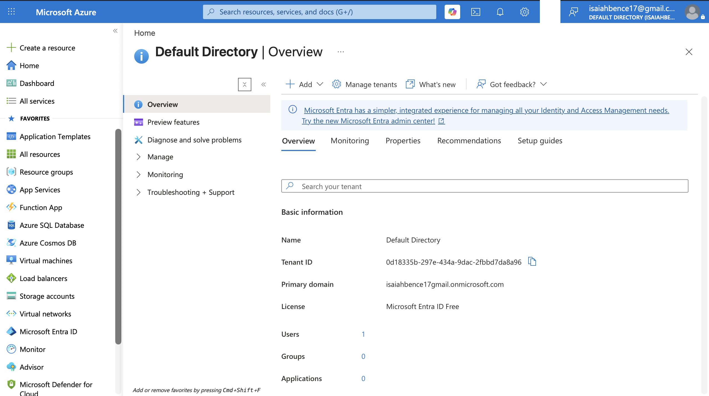

## 2. Cloud User Creation
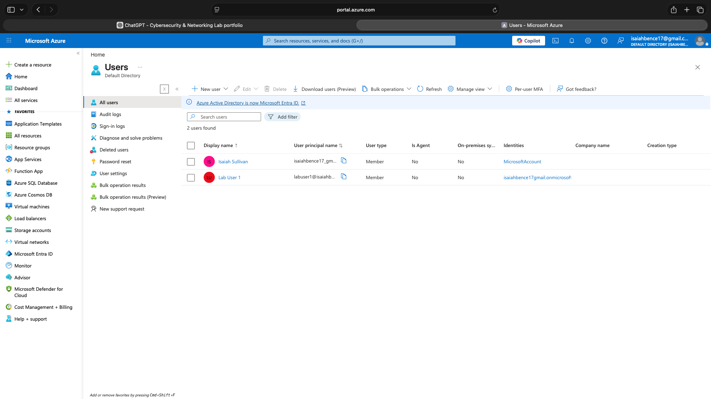

## 3. Security Group Creation
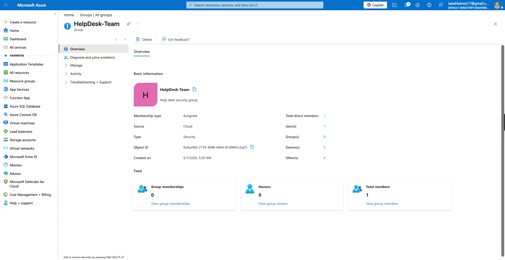

## 4. Password Reset Operations
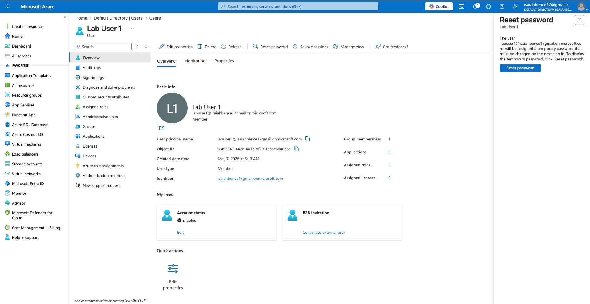

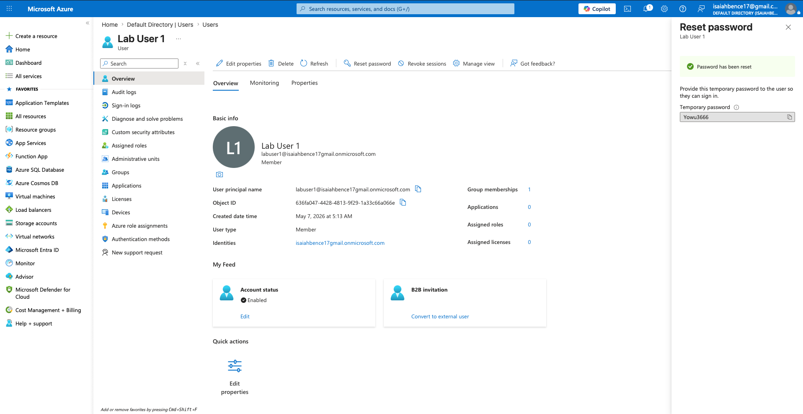

## 5. User Account Disable
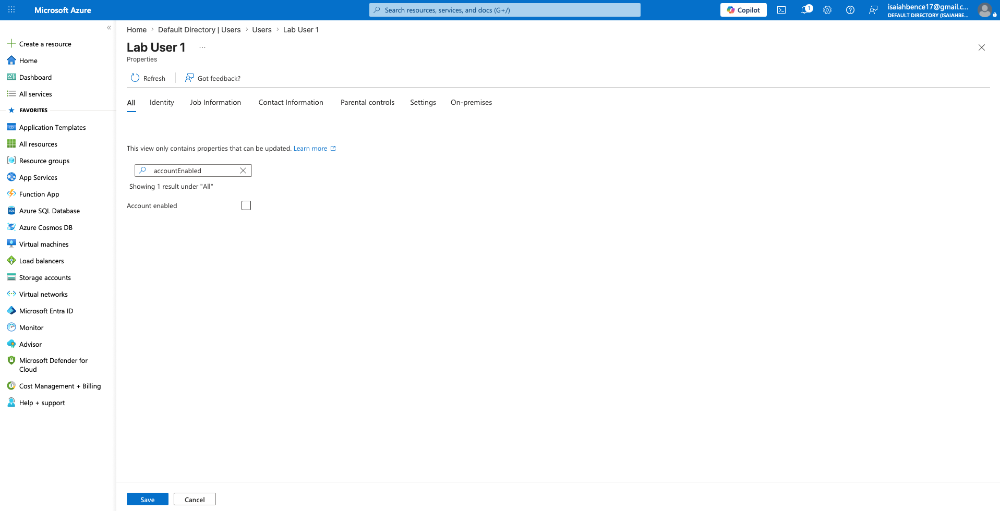

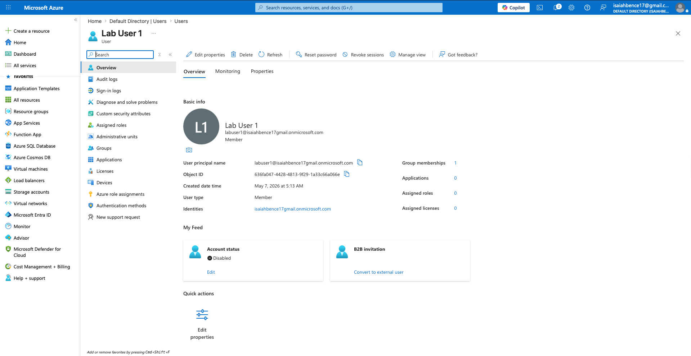

## 6. User Account Re-Enabled
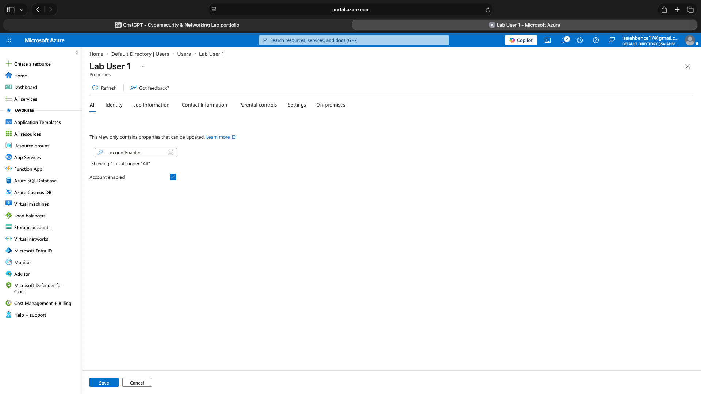

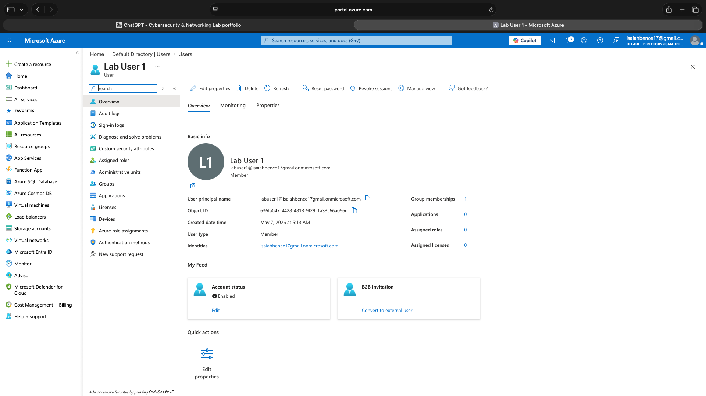

## 7. Audit Logs Review
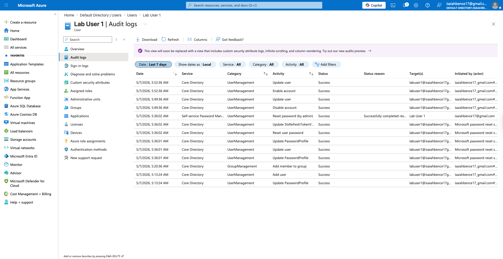

## 8. Sign-In Logs Review
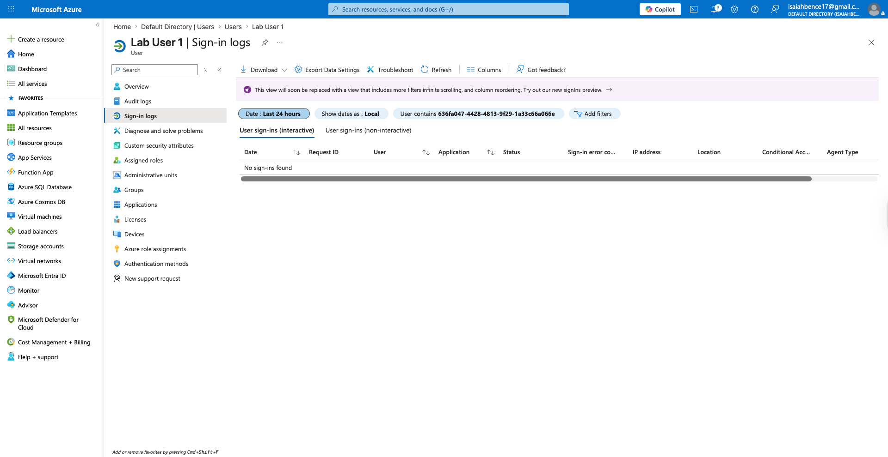

## 9. Authentication Methods
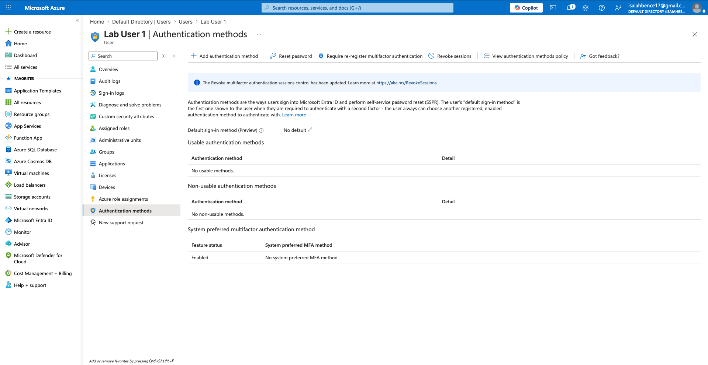

## 10. RBAC Role Assignment
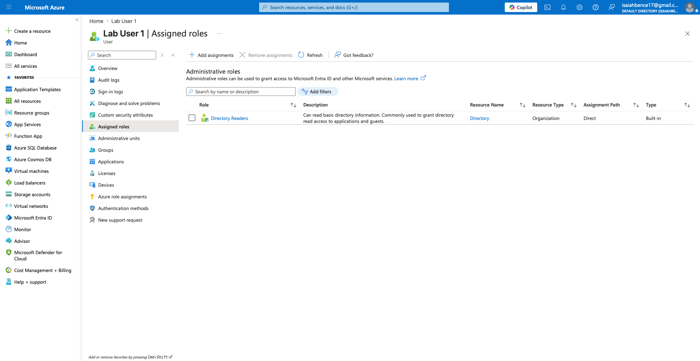

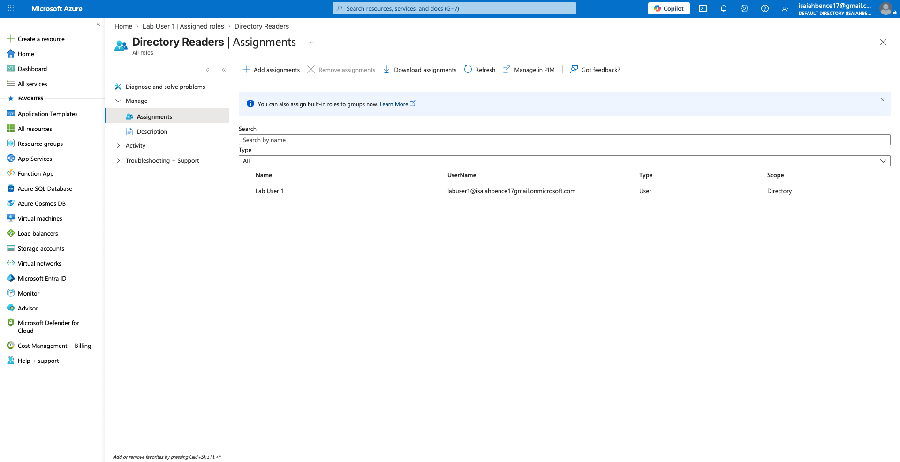

## 11. Enterprise Applications Overview
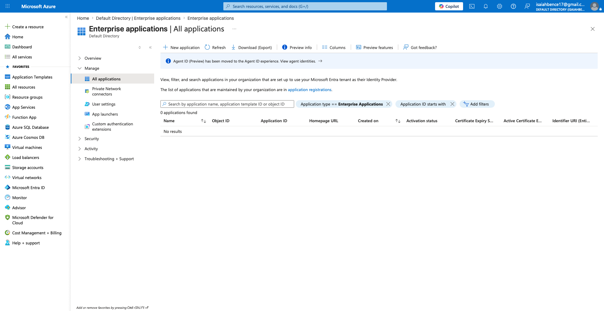

## 12. Conditional Access Overview
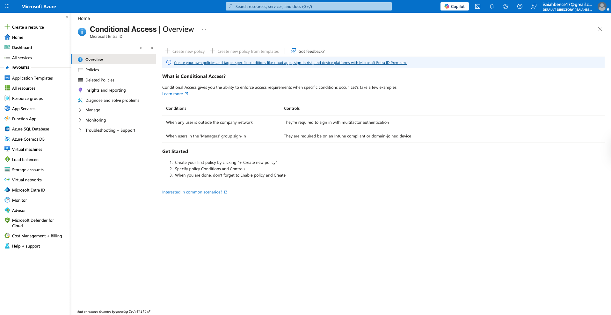

## 13. Administrative Units
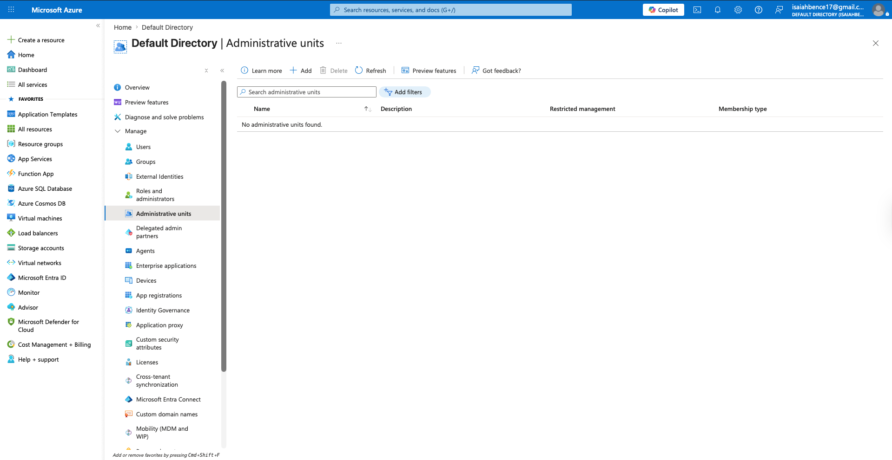

## 14. Final Environment Overview
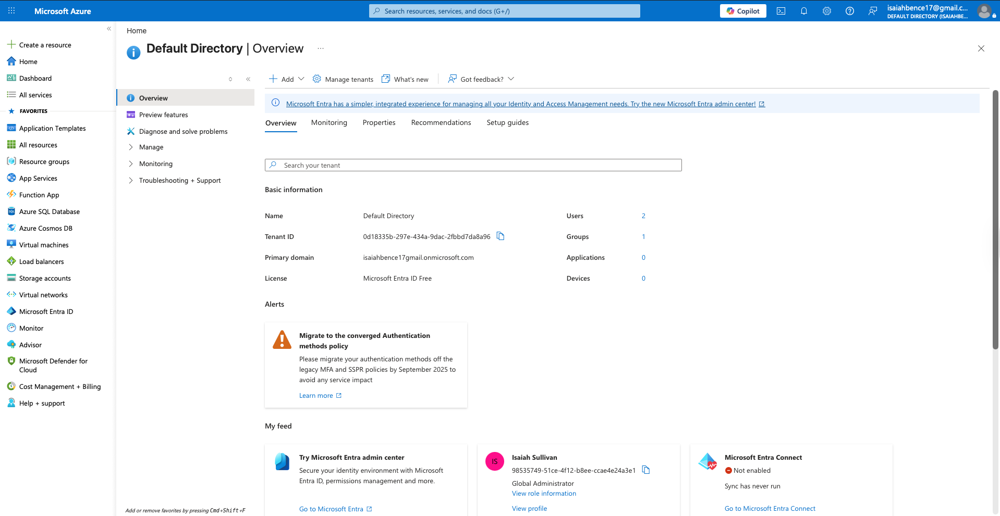

---

# Lessons Learned
This lab helped reinforce core Microsoft Entra ID administration skills including identity management, RBAC permissions, account lifecycle management, and security monitoring within Azure cloud environments.
