# Windows Domain Administration Lab

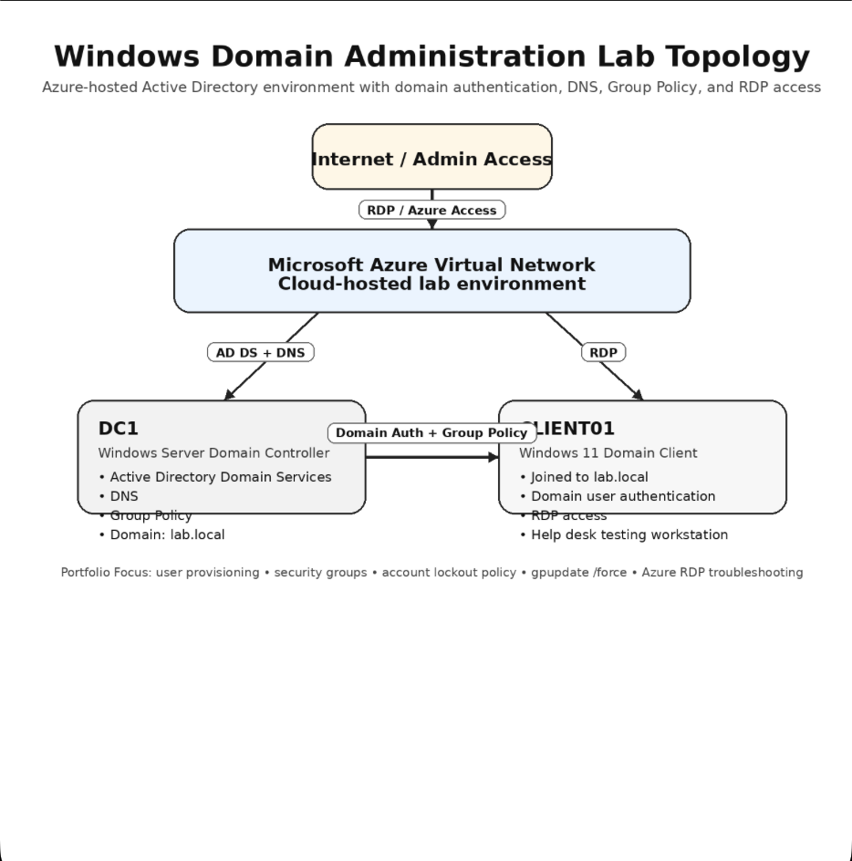## Project Overview


This project demonstrates hands-on Windows Server and Active Directory administration skills using Microsoft Azure virtual machines. The lab environment included a Domain Controller named DC1 and a Windows 11 client machine named CLIENT01 joined to the lab.local domain.

The project focused on enterprise identity management, Group Policy administration, account security policies, user administration, and domain management tasks commonly performed in help desk and junior system administrator roles.

---

## Environment

| System | Purpose |
|---|---|
| DC1 | Windows Server Domain Controller |
| CLIENT01 | Windows 11 Domain Client |
| Microsoft Azure | Cloud virtualization platform |
| Active Directory | Identity and access management |
| Group Policy | Security policy management |

---

---

## Tools Used

- Microsoft Azure
- Windows Server 2025
- Windows 11
- Active Directory Users and Computers
- Group Policy Management
- Remote Desktop Protocol (RDP)
- PowerShell
- Command Prompt

- ## Skills Demonstrated

- Active Directory Domain Services (AD DS)
- Domain user account administration
- Security group creation and management
- Group Policy configuration
- Account lockout policy deployment
- Windows domain join operations
- Remote Desktop Protocol (RDP)
- Help desk troubleshooting workflows
- Windows administration
- Azure virtual machine administration

---

## Lab Tasks Completed

### 1. Verified Server Configuration

Verified the Windows Server local server configuration, including the computer name, domain name, AD DS, and DNS role visibility.

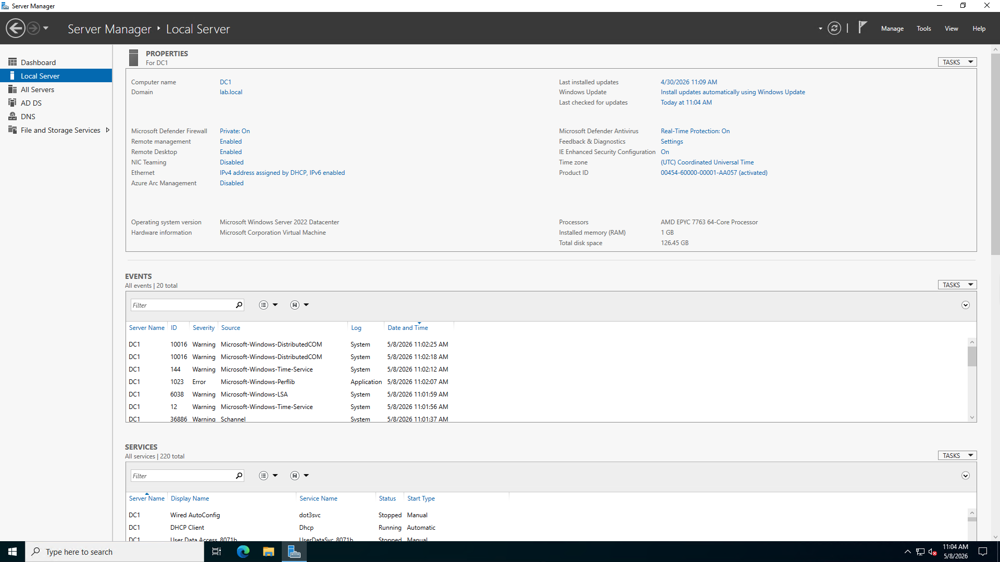

---

### 2. Verified Active Directory Domain Structure

Opened Active Directory Users and Computers and confirmed the lab.local domain structure was available.

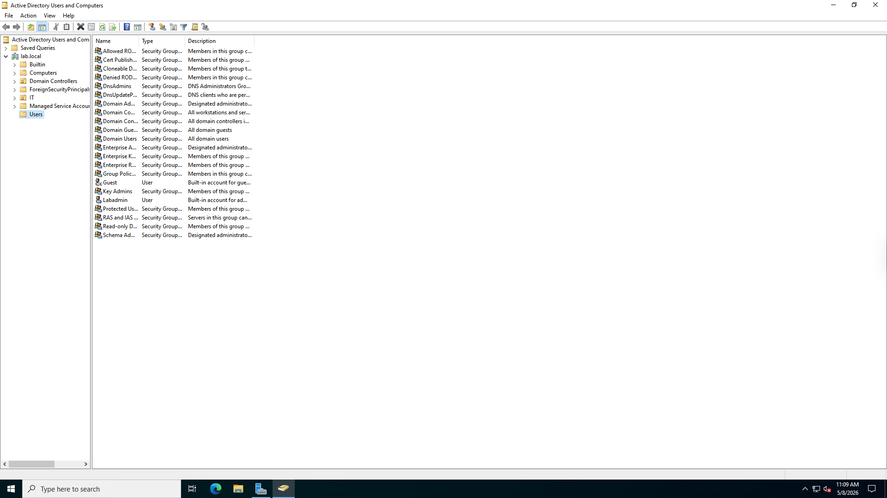

---

### 3. Created a New Domain User

Created a new Active Directory user account for John Smith as part of a help desk onboarding scenario.

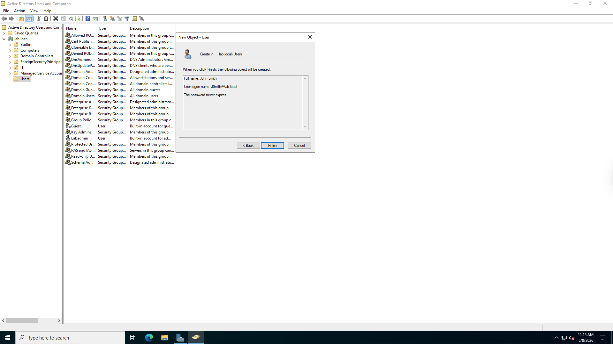

---

### 4. Verified User Account Creation

Confirmed the new user account appeared inside Active Directory Users and Computers.


---

### 5. Created a Security Group

Created a new global security group named HelpDesk to simulate department-based access control.

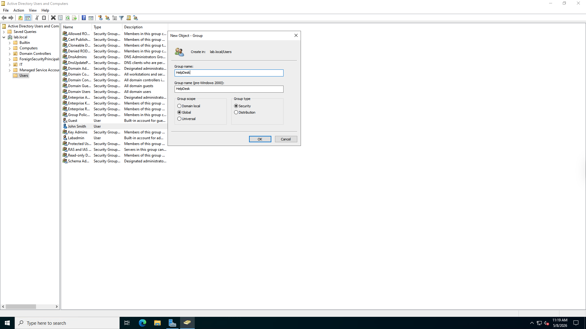

---

### 6. Verified Security Group Creation

Confirmed the HelpDesk security group was created successfully in Active Directory.


---

### 7. Added User to Security Group

Added John Smith to the HelpDesk security group to simulate assigning access through group membership.

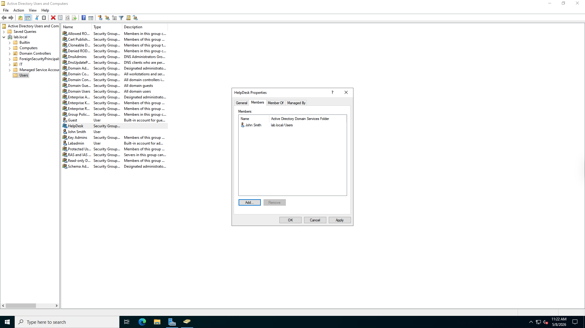

---

### 8. Opened Group Policy Management

Opened Group Policy Management and selected the Default Domain Policy for the lab.local domain.

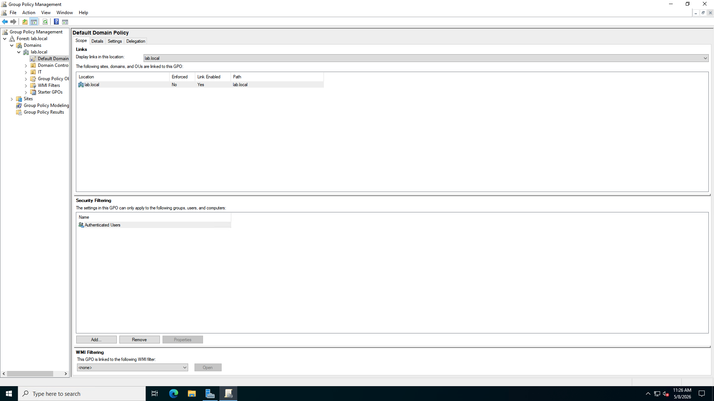

---

### 9. Opened Group Policy Editor

Opened the Group Policy Management Editor to configure domain-level security settings.

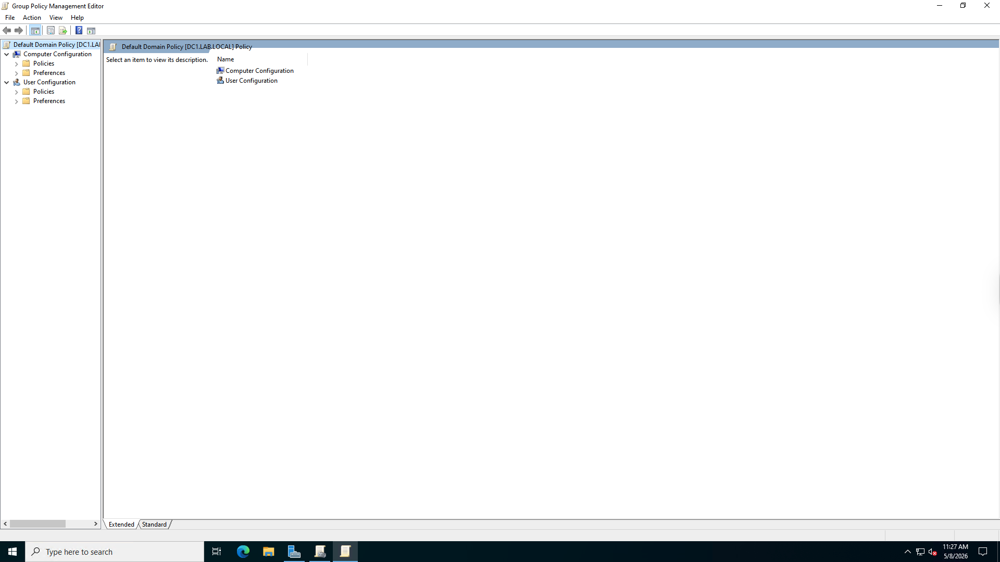

---

### 10. Reviewed Account Lockout Policy Settings

Navigated to the Account Lockout Policy settings inside Group Policy before applying the new configuration.

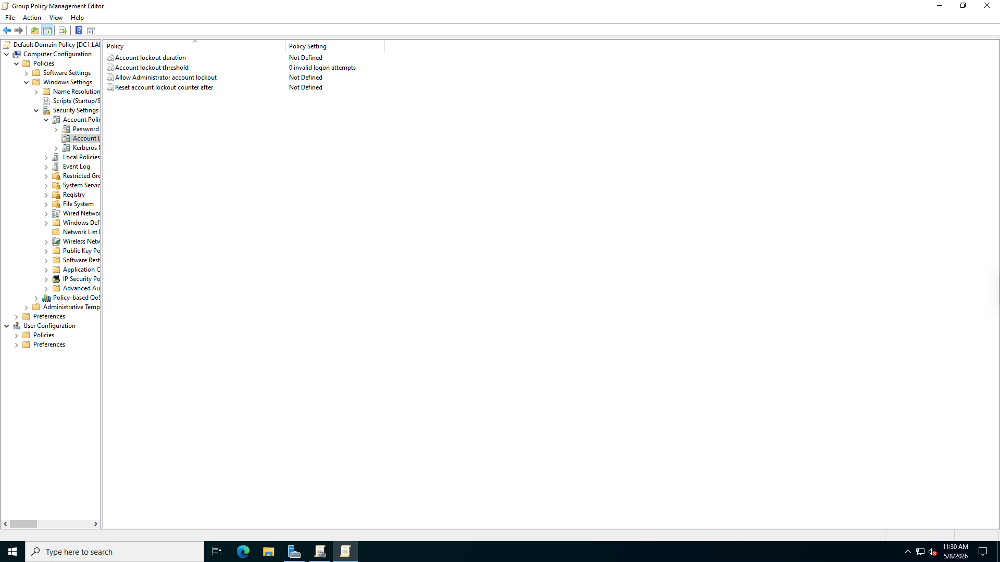

---

### 11. Configured Account Lockout Threshold

Configured the account lockout threshold to lock accounts after three invalid logon attempts.

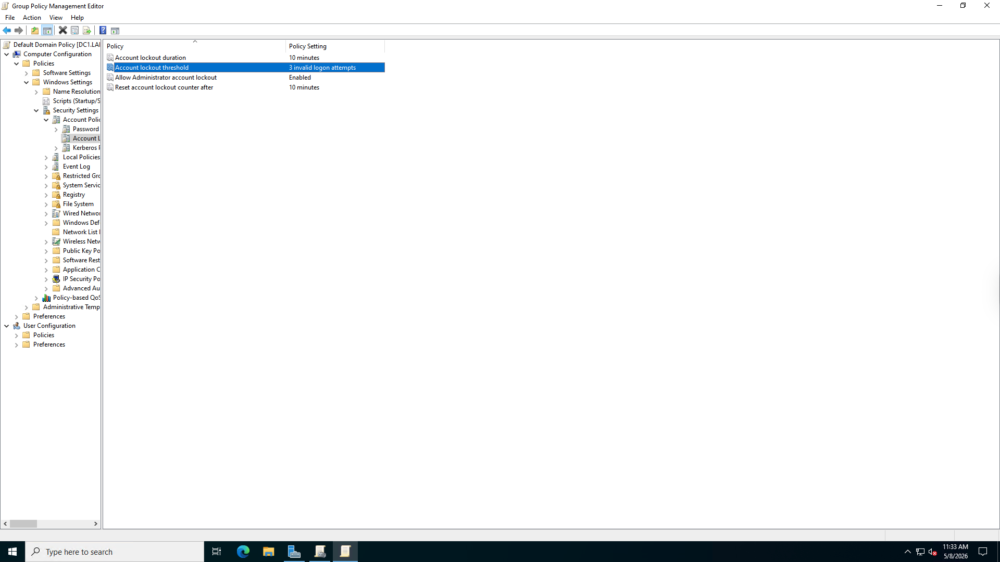

---

### 12. Forced Group Policy Update

Ran gpupdate /force to apply Group Policy changes immediately.

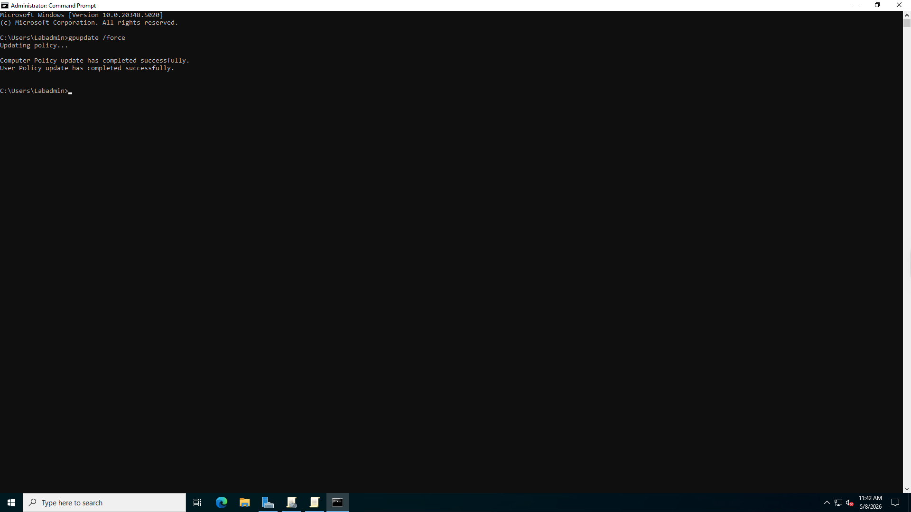

---

## Commands Used

### Force Group Policy Update

```powershell
gpupdate /force
```

### Run Command As Domain User

```cmd
runas /user:lab.local\JohnSmith cmd
```

---

## Troubleshooting Encountered

### RDP Authentication Issues

During the lab, Remote Desktop credential caching and Azure RDP behavior caused issues when attempting to switch between the local azureadmin account and domain user accounts.

### Azure VM Session Handling

The Azure-hosted Windows client automatically reconnected to previously authenticated sessions, which prevented the normal multi-user Windows login screen from appearing consistently.

### RDP Configuration Fix

Remote Desktop was re-enabled remotely from Azure using a PowerShell Run Command. This helped restore access to CLIENT01 after connection errors occurred.

### Group Policy Propagation

After configuring account lockout policies, Group Policy was manually refreshed using gpupdate /force to apply the new domain security settings.

---

## Key Takeaways

This lab provided practical experience with enterprise Windows administration, Active Directory management, security group configuration, Group Policy deployment, domain client verification, and Azure VM troubleshooting.

The lab also showed how real-world help desk work often involves more than one tool. Active Directory, Group Policy, Remote Desktop, Azure, and Windows client settings all had to work together for the environment to function properly.

---

## Future Improvements

- Create Organizational Units (OUs)
- Add more test users
- Configure separate GPOs for users and computers
- Add shared folder permissions
- Configure mapped network drives
- Add PowerShell automation
- Document account unlock and password reset workflows
- Build a full help desk ticket simulation
