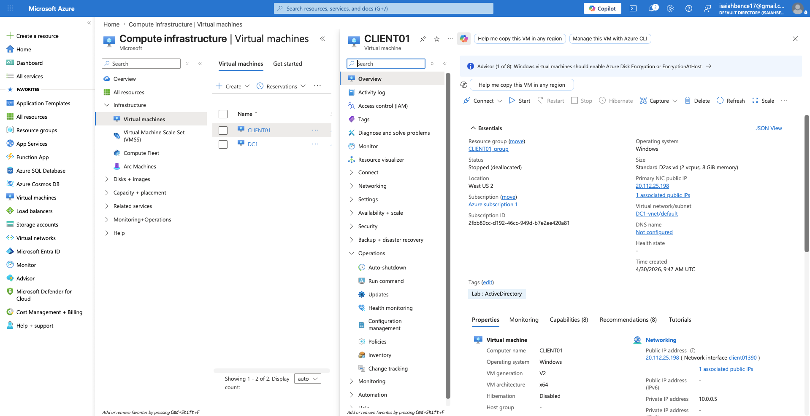
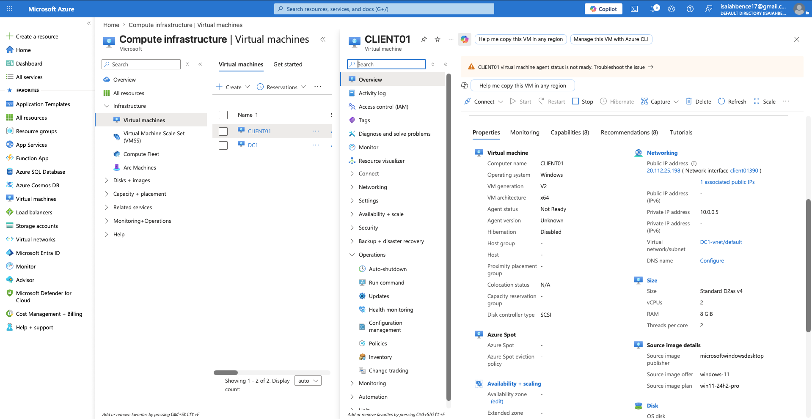
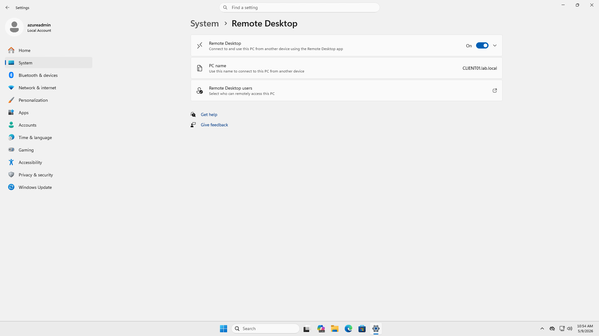
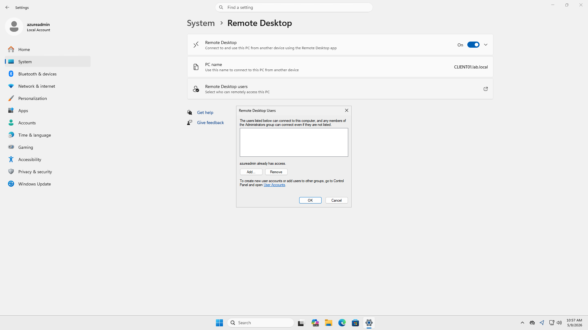
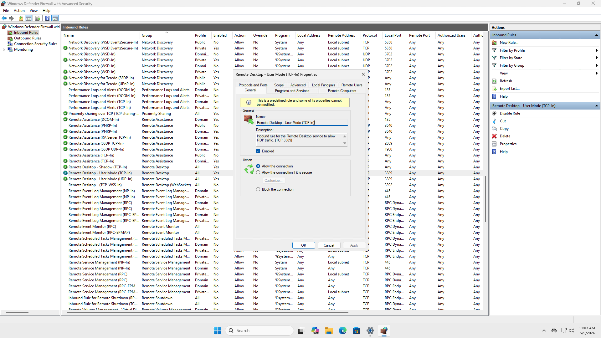
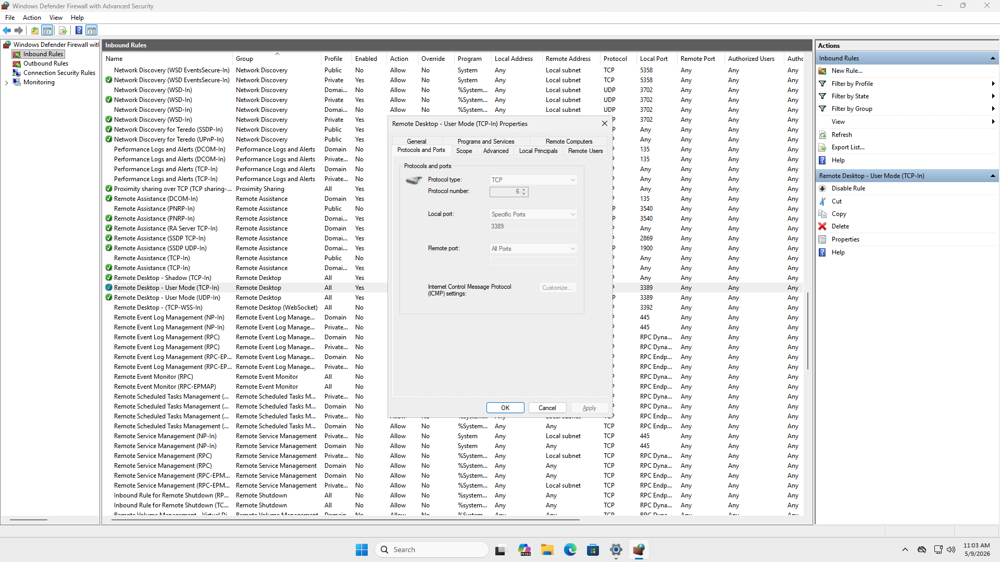
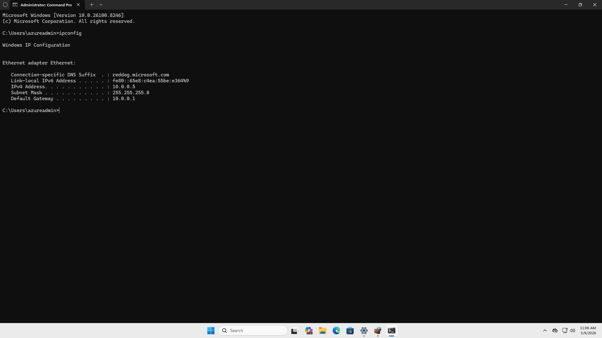

# Windows Remote Access & RDP Security Lab

## Overview

This lab demonstrates the configuration and verification of Remote Desktop Protocol (RDP) access on a Microsoft Azure Windows virtual machine. The project focuses on remote administration, Windows Firewall configuration, Remote Desktop user management, and basic network verification.

## Objectives

- Configure and verify Remote Desktop access
- Review Remote Desktop user permissions
- Verify Windows Firewall RDP rules
- Validate TCP port 3389 configuration
- Perform network verification using ipconfig
- Demonstrate secure remote administration practices

---

# Technologies Used

- Microsoft Azure
- Windows Virtual Machine
- Remote Desktop Protocol (RDP)
- Windows Defender Firewall
- Command Prompt
- TCP/IP Networking

---

# Azure Virtual Machine

## Azure VM Overview

## Public IP Address Verification

---

# Remote Desktop Configuration

## Remote Desktop Settings

## Remote Desktop Users

---

# Windows Firewall Configuration

## RDP Firewall Rules

The firewall rules verified that Remote Desktop traffic over TCP port 3389 was enabled and allowed through Windows Defender Firewall.

---

# Network Verification

## IP Configuration Verification

The ipconfig command was used to verify:
- IPv4 addressing
- Subnet mask configuration
- Default gateway information

---

# Security Considerations

- Verified Windows Firewall RDP rules
- Confirmed TCP port 3389 configuration
- Restricted Remote Desktop access to authorized users
- Used secure Azure virtual machine administration practices
- Deallocated the virtual machine after testing to reduce unnecessary exposure and cloud resource usage

---

# Skills Demonstrated

- Windows administration
- Remote Desktop configuration
- Firewall rule verification
- Azure virtual machine management
- TCP/IP networking
- Command-line networking verification
- Basic remote access security administration
