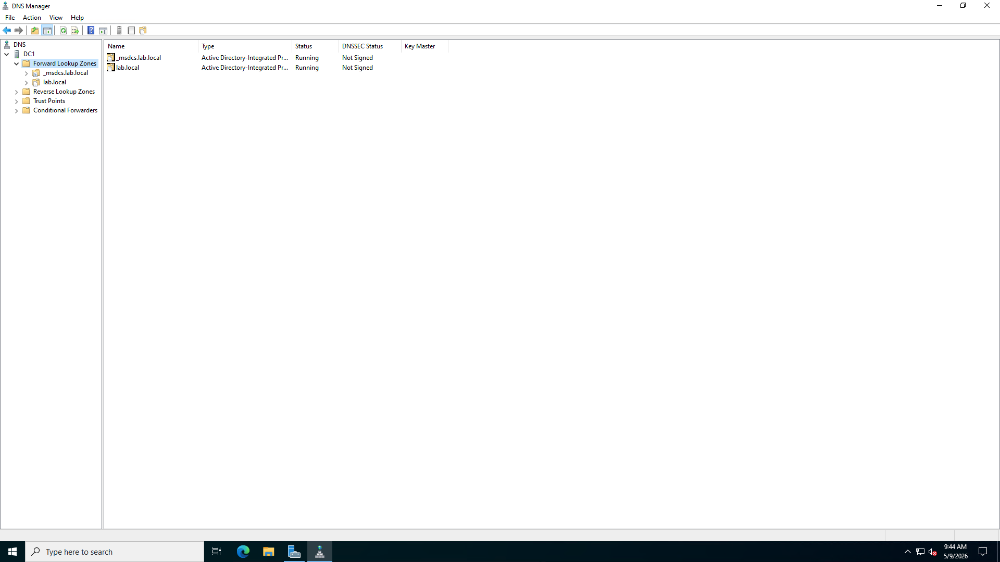
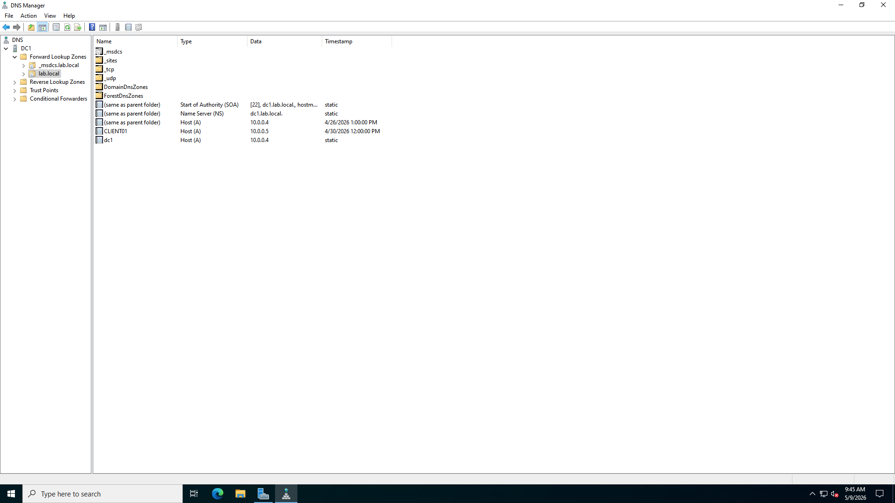
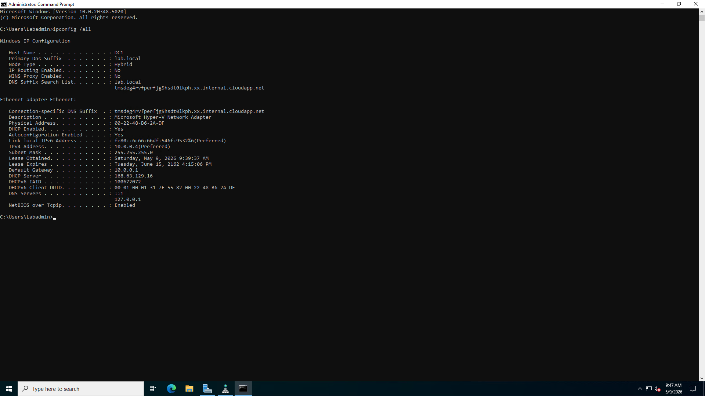
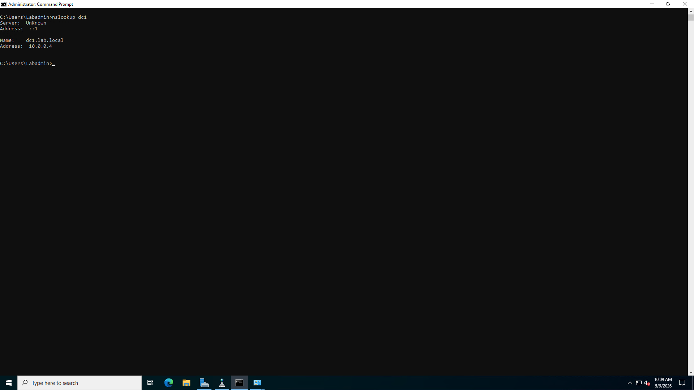
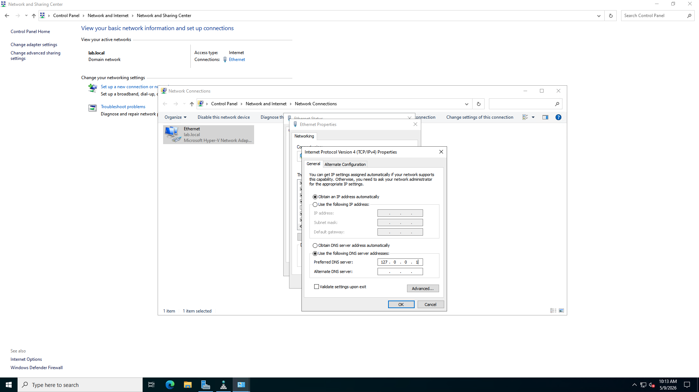

# DNS Configuration & Troubleshooting Lab

## Lab Overview

This lab demonstrates DNS configuration, troubleshooting, and verification within a Windows Server Active Directory environment.

The purpose of this project was to practice:
- DNS zone management
- Name resolution testing
- DNS troubleshooting
- Command-line diagnostics
- Network configuration repair
- Help desk and system administration troubleshooting procedures

This lab was performed using Windows Server and Active Directory integrated DNS services.

---

# Technologies Used

- Windows Server 2022
- Active Directory Domain Services (AD DS)
- DNS Manager
- Command Prompt
- TCP/IP Configuration
- Microsoft Hyper-V / Azure VM Environment

---

# Environment Information

| System | Hostname | IP Address |
|---|---|---|
| Domain Controller | DC1 | 10.0.0.4 |
| Client Machine | CLIENT01 | 10.0.0.5 |

Domain Name:

```text
lab.local
```

---

# Objectives

- Verify DNS zone configuration
- Test internal DNS resolution
- Test external DNS resolution
- Simulate DNS misconfiguration
- Troubleshoot DNS issues
- Restore DNS functionality
- Verify successful DNS repair

---

# DNS Configuration Verification

The DNS Manager console was opened to verify the Active Directory integrated forward lookup zone and DNS records.

## DNS Manager


---

## Forward Lookup Zone



---

## DNS Records



---

## Domain Controller DNS Settings



---

# DNS Resolution Testing

DNS resolution testing was performed using the `nslookup` command.

## DC1 DNS Resolution


---

## CLIENT01 DNS Resolution


---

## External DNS Resolution


---

# DNS Troubleshooting Simulation

A DNS misconfiguration was intentionally created by changing the DNS server to an incorrect external DNS address.

This simulated a real-world troubleshooting scenario commonly encountered in help desk and system administration environments.

---

## Incorrect DNS Configuration


---

## DNS Test with Incorrect DNS Configuration



---

## DNS Misconfiguration Identified


---

# DNS Repair Process

The DNS server settings were corrected and DNS cache was flushed to restore proper name resolution functionality.

---

## DNS Server Restored



---

## DNS Cache Flushed


---

## DNS Functionality Restored


---

# DNS Service Verification

The DNS service status was verified after troubleshooting was completed.

---

## DNS Service Running


---

# Skills Demonstrated

- DNS administration
- Active Directory DNS integration
- Internal hostname resolution
- External DNS testing
- DNS troubleshooting
- TCP/IP configuration management
- Windows command-line diagnostics
- Network troubleshooting
- IT help desk troubleshooting workflow
- System administration fundamentals

---

# Outcome

This lab successfully demonstrated the ability to configure, test, troubleshoot, and repair DNS functionality within a Windows Active Directory environment.

The project also demonstrated practical help desk troubleshooting methodology and system administration diagnostic procedures.
